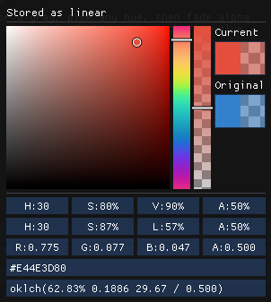
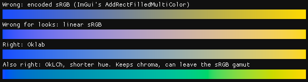
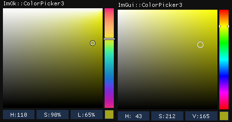
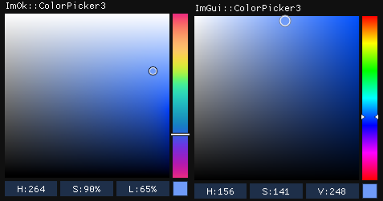

# ImOk (imgui-oklab)

Color widgets and color math for [Dear ImGui](https://github.com/ocornut/imgui), built on Björn
Ottosson's Oklab, its polar form OkLCh (the same values as CSS `oklch()`), and Okhsv and Okhsl:
for engines that light in linear sRGB, and for artists who pick colors by eye.



## Color in an engine

A color passes through three kinds of numbers, and each is good at one job.

| Role | Space | Used for |
|---|---|---|
| 8-bit storage | encoded sRGB | textures, hex codes, ImGui colors, the screen |
| Physics | linear sRGB | lighting, blending, filtering |
| Perception | Oklab, OkLCh, Okhsv, Okhsl | gradients, picking, lighter or darker |

**Encoded sRGB**, often called gamma-encoded, is how colors are stored in 8 bits. 256 steps
aren't many, so encoding puts more of them in the darks, where the eye notices. The darkest 10%
of light gets 90 steps when encoded, 27 when stored as linear sRGB.

**Linear sRGB** is amounts of light: 0.5 is half as much as 1. Light adds up and mixes, so the
math happens here. Black and white mixed 50/50 as light give 188 (of 255). Mix the encoded
numbers instead and you get 128, too dark.

Both are sRGB: the same colors, numbered two ways. Engines and graphics APIs often say just
"sRGB" for the encoded one, so `_SRGB` texture formats and "sRGB" checkboxes mean encoded. ImOk
always names both: `EncodedSrgb` and `LinearSrgb`.

**Oklab** numbers colors by how they look: equal steps look like equal changes. OkLCh is the
same space as lightness, chroma and hue. Okhsv and Okhsl are pickers built on it.



### Your floats don't say which

8-bit colors are always encoded. Float colors can be either, and only you know which. ImGui
assumes encoded. Engines keep material and light colors in linear sRGB (glTF's
`baseColorFactor`, Unreal's `FLinearColor`). Give those floats to `ImGui::ColorEdit3` and the
orange `#CC4C33` shows as `#9A1308`, and what the artist picks looks washed out in the game.
Nothing warns you. ImOk makes you say what your floats hold at every call: `ImOkStoredAs`.

### HSV is not how colors look

ImGui's picker computes HSV from the encoded numbers. At full saturation and value, yellow has
an Oklab lightness of 0.97 and blue 0.45: the same V, less than half as light. Okhsv and Okhsl
keep the square and hue bar artists know, built on Oklab. In Okhsl, colors with the same l look
equally light.

Below is one color at hue 110 and at 264, with Okhsl's s and l fixed. ImOk's marker stays put.
ImGui's moves, and its V reads 165, then 248 (of 255).





### Decode once, work, encode once

One pixel, from Photoshop to the screen:

```text
Photoshop   #CC4C33, encoded
texture     8-bit, encoded
sampler     decodes to linear sRGB
shader      lighting, blending, filtering in linear sRGB
tonemapper  brings bright light into 0-1
encode      back to 8-bit, encoded
monitor     shows it
```

A color is decoded once, where it comes in, and encoded once, where it goes out. A missing or
extra step shifts every color, and nothing warns you. The GPU does both for free. A texture with
an `_SRGB` format decodes when it's sampled, and a render target with one encodes when it's
written.

Only color textures are encoded. Normal maps, roughness and masks are data: the numbers the
shader wants, as they are. Decoding changes them, so a mask's 0.5 becomes 0.21. Engines have a
checkbox for this, "sRGB (Color Texture)" in Unity and "sRGB" in Unreal, and it's off for data.

Tonemapping is its own step, before the encode. A lit scene goes past 1. The tonemapper brings
it into 0-1 with a curve, so highlights roll off instead of clipping. Then it's encoded like any
other color.

Your final image gets encoded in one of two places:

- **The swapchain encodes.** You draw the scene through an `_SRGB` view of it, and every write
  is encoded.
- **Your shader encodes.** The swapchain is plain UNORM and stores what it's given, so your last
  pass, usually the tonemapper, encodes before it writes.

ImGui's colors, ImOk's included, are already encoded, so ImGui must never go through an `_SRGB`
view. With the second setup that's automatic. With the first, give ImGui a UNORM view of the
same buffer. The demo's Good practices show how.

## Quick start

```cpp
#include "imok.h"

ImOk::ColorEdit3("Text color", textColorEncoded, ImOkStoredAs_EncodedSrgb); // float[3], as ImGui's widgets
ImOk::ColorEdit3("Light color", lightColorLinear, ImOkStoredAs_LinearSrgb); // float[3] in linear sRGB
ImOk::ColorEdit4("Tint", tintLinear, ImOkStoredAs_LinearSrgb);              // float[4]: alpha is stored as-is
```

`ImOkStoredAs` has no default, since only you know what your floats hold. Put the space in the
variable's name too: when the name and the argument disagree, you see it at the call.

Right-click a widget to switch its picker (Okhsv or Okhsl) or what its fields show: Okhsv,
Okhsl, the stored floats, hex or CSS `oklch()`. The same menu copies the color, each format
named by its space. Hover a swatch for its values.

Widgets follow ImGui's item width and return true when the value changed. There is no setup:
no context, no init call.

`ColorPicker3/4` are the pickers without fields. `ColorPickerOkhsv/Okhsl` edit an `Okhsv` or
`Okhsl` value directly, for tools that keep one, such as palettes.

Colors stay in 0-1, so a bright light or a glowing surface is a color times a separate
brightness. ImOk has widgets for the other values an engine multiplies:

- `TemperatureEdit`: a temperature in kelvin. `KelvinToLinearSrgb` gives its blackbody color.
- `IntensityEdit`: an intensity in a unit you name (lumens, candela, lux, nits, EV100 or
  unitless). ImOk never converts between units.
- `ImOkColorEditFlags_NoBrightness`: a color widget for a light's color, hue and saturation
  only.

`LightEdit` puts all three in one row, and `LightPicker` is its popup on its own. The demo
explains the model.

For undo, commit when `ImGui::IsItemDeactivatedAfterEdit()` is true, which works on the pickers
too. Also commit when a widget returns true while `!ImGui::IsItemActive()`: that's a drop.

## Color math

`imok_color.h` has no dependencies, not even ImGui, so it works in game code too. Every name
says both spaces, and each move between them is one call.

| To | Call |
|---|---|
| Decode or encode | `EncodedSrgbToLinearSrgb`, `LinearSrgbToEncodedSrgb` |
| Read or write hex | `HexToEncodedSrgb` (CSS's 3, 4, 6 and 8 digits), `EncodedSrgbToHex` |
| Go to Oklab and back | `LinearSrgbToOkLab`, `OkLabToOkLCh`, `OkLabToOkhsv`, ... |
| Mix | `LerpLinearSrgb` for light, `LerpOkLab` and `LerpOkLCh` for gradients. There is no encoded one |
| Measure brightness | `RelativeLuminance`: physical, for exposure and contrast. How light a color looks is Oklab's L |
| Fit into sRGB | `ClipToSrgbGamut`, keeping hue |

`imok.h` adds the crossings to ImGui's colors. `ImU32ToLinearSrgb` and `ImVec4ToLinearSrgb`
decode them. `LinearSrgbToImU32` and `LinearSrgbToImVec4` encode for drawing, and clip colors
outside 0-1 keeping hue.

## Integration

Requires C++14 and Dear ImGui 1.92.6 or newer, checked by an `#error`. CI builds 1.92.6 and
1.92.9b, and 1.92.9b's docking branch with multi-viewports. Add these files to your build, next
to ImGui's:

| Files | Contents |
|---|---|
| `imok.h`, `imok.cpp`, `imok_internal.h` | Widgets and drawing helpers |
| `imok_color.h`, `imok_color.cpp`, `imok_color_internal.h` | Color math, no ImGui dependency |
| `imok_demo.cpp` (optional) | `ImOk::ShowDemoWindow()` |

`imok.cpp` uses one function from `imgui_internal.h`, `MarkItemEdited`, so picker drags report
`IsItemEdited()` and `IsItemDeactivatedAfterEdit()`. It hasn't changed since ImGui 1.70.

## Renderer requirement

A picker's square is a fine mesh of up to 16641 vertices, so four large pickers in one window
pass 65536. With 16-bit indices, ImGui can split that window only if your renderer supports it;
otherwise `ImGui::Render()` asserts. You need one of:

- `ImGuiBackendFlags_RendererHasVtxOffset` set, and `ImDrawCmd::VtxOffset` used as each draw
  call's base vertex, or
- 32-bit indices: `#define ImDrawIdx unsigned int` in your `imconfig.h`, and a 32-bit index
  buffer.

Most official backends do the first. OpenGL2, Allegro5, and OpenGL3 built for GLES or WebGL
don't.

## Planned

Not built yet, in no particular order:

- More pickers: color wheels, an Okhsl hue x lightness square, and an OkLCh picker.
- Storing colors as Oklab or OkLCh.
- Editable OkLCh fields (read-only today).
- A gradient editor, for particle colors over lifetime and UI ramps.
- Swatches that show transparency blended in linear sRGB, as most engines blend.

## Learn more

Read the demo, not only run it: add `imok_demo.cpp` and call `ImOk::ShowDemoWindow()`. Each
section starts with a TL;DR, and the code beside it is the usage example. `imok.h` documents
the widgets, `imok_color.h` the color spaces. `example/` builds a Win32 + DirectX 11 app that
shows ImOk's demo.

## Credits and license

ImOk is MIT licensed: see `LICENSE.txt`.

The color math in `imok_color.cpp` (Oklab, Okhsv, Okhsl, gamut clipping) is ported from Björn
Ottosson's `ok_color.h`, and the hue bar follows his interactive color picker. Both are MIT
licensed, and his notice is in the header of `imok_color.cpp`. When you ship ImOk, include both
notices.

- [A perceptual color space for image processing](https://bottosson.github.io/posts/oklab/)
- [sRGB gamut clipping](https://bottosson.github.io/posts/gamutclipping/)
- [Okhsv and Okhsl](https://bottosson.github.io/posts/colorpicker/)
- [Interactive color picker comparison](https://bottosson.github.io/misc/colorpicker/)